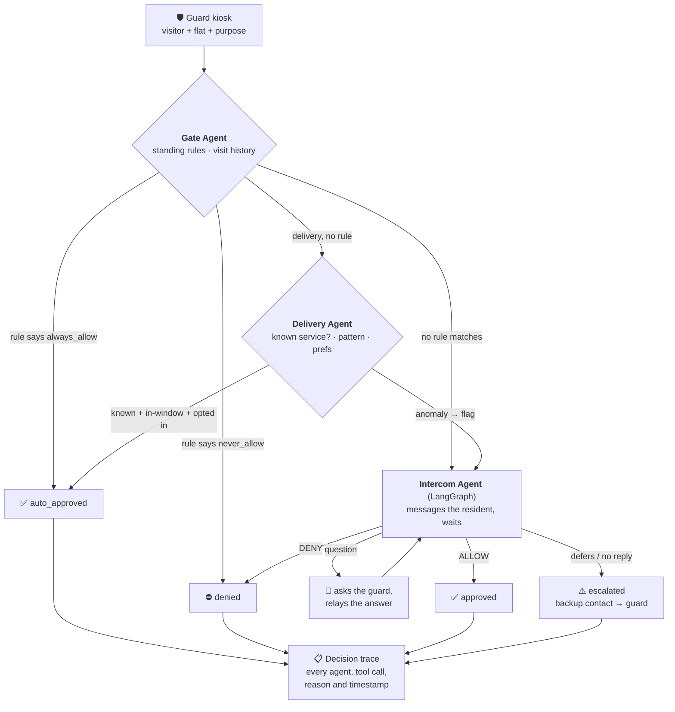

<div align="center">
  
  <p><strong>AI visitor management for gated communities.</strong></p>
</div>

---

A visitor arrives at a society gate. Today a guard phones the flat, someone
doesn't pick up, and the visitor waits. GateSense answers that call instead:
three cooperating AI agents screen the visitor, clear the obvious cases in
seconds, and involve the resident only when there's a real decision to make —
leaving a complete, human-readable record of *why* every call was made.

It is multi-tenant SaaS: one deployment serves many societies, and a society can
never see another's data (see [Tenant isolation](#tenant-isolation-two-layers)).

## How it works

A guard logs a visitor at the kiosk. From there:



**Gate** and **Delivery** are plain Claude tool-calling loops — they run to
completion in one shot, so a `while` loop is all they need. **Intercom** is a
LangGraph graph, because it must *pause* after messaging the resident and resume
minutes later when they reply, possibly looping through clarifications first.
That pause is `interrupt()`; the raw loop has no way to express it.

That pause is checkpointed to **Postgres**, so a deploy or crash mid-conversation
doesn't strand a visitor at the gate — a restarted process resumes exactly where
it left off. And if the resident simply never replies, a sweeper escalates the
session to their backup contact (or the guard) rather than leaving it open
forever; because it reads timestamps from the database rather than holding
in-process timers, timeouts that came due during a restart are still honoured.

Every agent's tools are backed by Postgres and scoped to the caller's society —
the model never sees another tenant's data, and never chooses which tenant it
is acting for (that comes from the request's JWT, not the model).

## Tenant isolation (two layers)

One deployment, many societies. Isolation does not rest on remembering a
`WHERE society_id = …` in every query:

| Layer | Mechanism | What it stops |
|---|---|---|
| **Application** | `society_id` comes from the caller's JWT, never from user input or the model | A caller asking for another society's data |
| **Database** | Postgres **row-level security**; every request runs as a non-superuser role with `app.current_society_id` set | A missed `WHERE` clause, an injection, or an agent tool bug |

RLS is the layer that matters: a superuser connection *bypasses* RLS, so the app
`SET ROLE`s into a dedicated non-superuser (`app_rls`) and sets the society as a
GUC. Policies compare each row against `current_setting('app.current_society_id')`.
Even a query with no filter at all returns only the caller's rows.

Residents get a third narrowing: RLS scopes to the *society*, but a resident must
only see their own *flat*, so resident-facing routes filter on their linked flat
and cross-flat reads/replies return `404` — see `backend/routers/portal.py` and
`main._assert_flat_access`. Proven in `backend/tests/test_rls.py` and
`test_portal.py`.

## Never auto-approve on failure

Agents call an LLM over a network; sometimes that times out. The rule is that a
failure may cost convenience, never safety — entry is **never** auto-approved
because something broke:

| What fails | What happens |
|---|---|
| Gate or Intercom agent | `escalated` to the guard's default policy + an escalation row |
| Delivery agent | routed to the resident — an unscreened delivery is never cleared |
| A resident's reply can't be parsed | session stays open; never resolved on a guess |
| The resident never replies | escalated to their backup contact, else the guard (`RESIDENT_TIMEOUT_MINUTES`, default 10) |
| The backend restarts mid-conversation | the graph resumes from its Postgres checkpoint |

The visitor record survives the failure too: fallbacks run *inside* the request's
transaction, so a crash can't roll back the record of someone standing at the
gate. See `backend/pipeline.py` and `backend/tests/test_failsafe.py`.

## Does it actually work?

21 hand-labeled scenarios across all three agents, scored on **the status a
session ends in** — what a resident actually cares about — not the model's
wording. Current: **21/21**.

Full table and methodology: **[docs/EVAL_REPORT.md](docs/EVAL_REPORT.md)**.

```bash
python -m backend.eval.run_eval     # regenerates the report (real Claude calls)
```

The eval earns its keep: on its first run it flagged `gate-07`, and the *label*
was wrong, not the agent — a flat with `auto_log_daytime` on legitimately clears
any known service, which the ground truth had ignored.

## Quickstart

Requires Docker, Python 3.12+, Node 20+, and an `ANTHROPIC_API_KEY`.

```bash
cp .env.example .env          # add your ANTHROPIC_API_KEY
./run-local.ps1 -InstallDeps -Seed
```

That starts Postgres, applies migrations, seeds demo data, and runs both dev
servers. Then open <http://localhost:5173>:

| Role | Login | Sees |
|---|---|---|
| Guard | `guard1@green.gatesense.in` | Kiosk — log a visitor |
| Society admin | `admin@green.gatesense.in` | Sessions, decision traces, notification health |
| Resident | `resident@green.gatesense.in` | Their flat's visitors + standing rules |
| Platform admin | `platform@gatesense.in` | All societies |

Password for every demo account: `password123`.

To watch the whole pipeline: sign in as the guard, submit **"Rajesh" → flat
A-101 → delivery → "Parcel from an unnamed local shop"**. Gate routes it to
Delivery, Delivery flags an unknown service, Intercom messages the resident —
then open the resident portal in another window and watch it arrive live.

<details>
<summary>Running things individually</summary>

```bash
docker-compose up -d db                     # Postgres on :55432
alembic upgrade head                        # migrations
python -m backend.seed                      # demo data
uvicorn backend.main:app --reload           # API on :8000  (/docs for OpenAPI)
cd frontend && npm run dev                  # SPA on :5173
```

`.env` is the single source of truth for `DATABASE_URL`; a real environment
variable overrides it (that's how CI and Railway work).
</details>

## Tests

```bash
python -m pytest backend/tests -q            # deterministic suite; runs in CI
RUN_AGENT_TESTS=1 python -m pytest backend/tests -q   # + live Claude tests
```

The default suite makes no API calls: RLS and flat scoping, DB-backed tools,
fail-safe fallbacks, error contract, and rate limits. Live agent tests and the
eval are opt-in, because they cost money and are non-deterministic.

## Layout

```
backend/
  agents/      gate + delivery (raw tool loops), intercom (LangGraph)
  tools/       agent tools — DB-backed, tenant-scoped via a *Context object
  routers/     auth, societies, residents, users, visitors, portal, admin
  pipeline.py  chains the agents; owns the fail-toward-human fallbacks
  deps.py      scoped_session (RLS), auth, role + resident gates
  realtime.py  WebSocket fan-out (per society; per flat for residents)
  checkpointer.py  durable intercom state (Postgres) — survives restarts
  timeouts.py  sweeper: escalates visitors left waiting on a silent resident
  eval/        hand-labeled scenarios + scorer
frontend/src/
  pages/       Landing, Login, Kiosk, Dashboard, SessionDetail, Portal, admin CRUD
  realtime.js  live session feed
docs/          eval report, deployment runbook, data retention
```

## Stack

FastAPI · PostgreSQL 16 (RLS) · SQLAlchemy + Alembic · Claude (`claude-sonnet-5`)
· LangGraph · React 19 + Vite · Railway + Vercel.

## Docs

- [Deployment runbook](docs/DEPLOYMENT.md) — Railway, Vercel, DNS, required secrets
- [Data retention & PII](docs/DATA_RETENTION.md)
- [Eval report](docs/EVAL_REPORT.md)
- [Build plan](BUILD_PLAN.md) — how this was built, phase by phase
